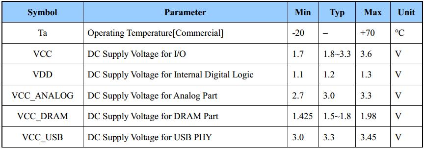
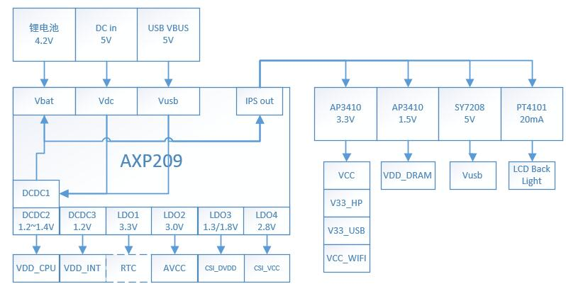
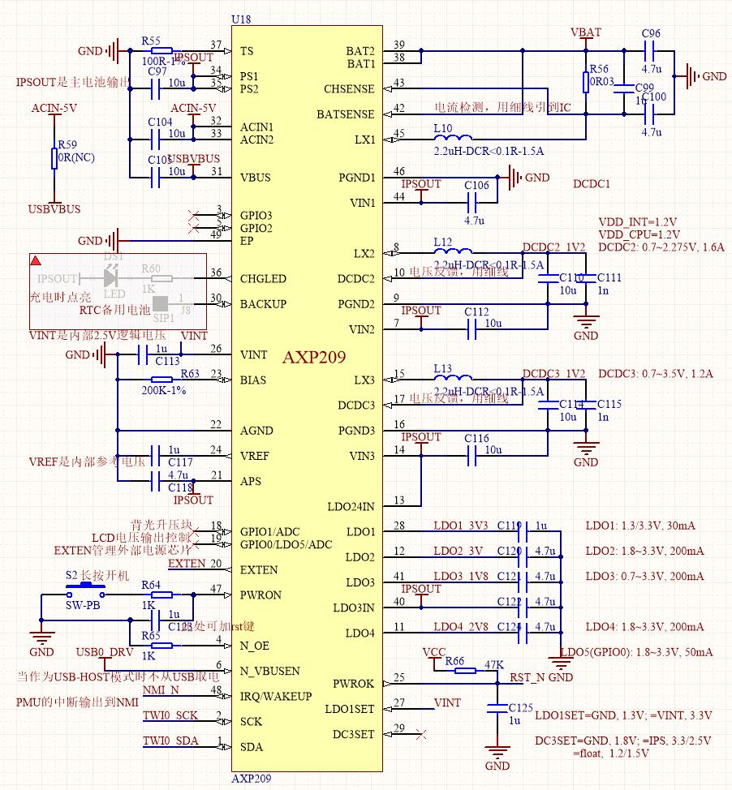
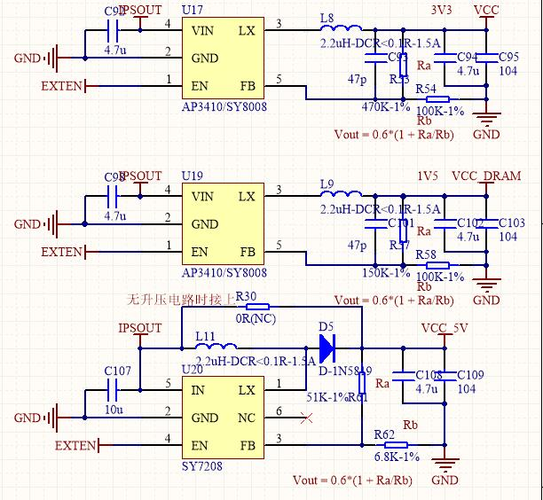
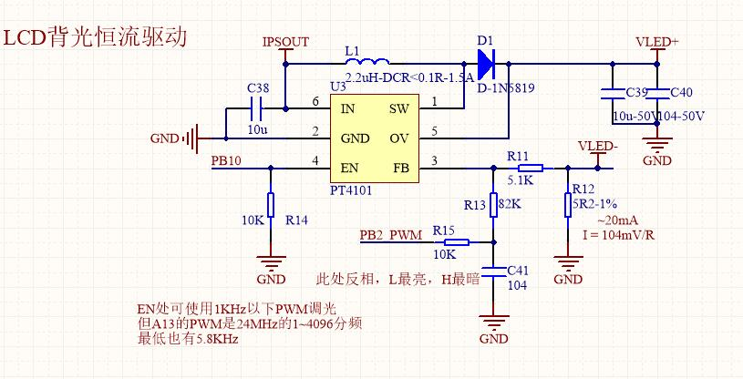

电源电路设计
==============

一. A13电源引脚介绍
-------------------------------

这里我们先找A13的主要电源引脚，也就是datasheet中标识为Power的引脚，用excel筛选下可得：

.. image:: ../_static/硬件/1.power.jpg

简单说下各电源的用处

========  =========
  电源        用途    
========  =========  
VCC	      IO口电源
AVCC	  模拟电路电源
VDD_CPU   CPU内核电压
VDD_INT	  Interrupt Power
          中断电源？
VCC_DRAM  内存电源
V33_HP	  耳机电源
V33_USB	  USB电源
========  =========

查阅手册可知它们的参考范围：

把板子上所有的电源按电压分类：

========  =======================  =======================
电压(V)	      电源名	                 备注
========  =======================  =======================
5	        DC输入电压	                  \-
4.2	        锂电池供电	                 \-
3.3         VCC,V33_HP,V33_USB	        \-
2.7~3.3	    AVCC	                为模拟键盘等供电
2.8	        摄像头电源	            工作电流约20mA
1.3/1.8	    摄像头内核电压	                \-
1.5	        VCC_DRAM	            最大工作电流IDD5B=200mA
1.1~1.4	    VDD_CPU	                不同电压对应不同主频
1.2	        VDD_INT	                   \-
========  =======================  =======================

可见板子上需要的电压种类比较多，如何生成、管理这些电源是个问题。

二. AXP209介绍及电源树设计
-------------------------------

AXP209 是专为全志A10/13/20等主控配备的电源管理芯片（PMU），管脚如下图所示：

.. image:: ../_static/硬件/3.power.jpg

具体功能可以查看它的datasheet，简而言之，它提供以下功能：

=========== ==================
功能            参数
=========== ==================
DC-DC2	     0.7~2.275V可调，1.6A max
DC-DC3       0.7~3.5V可调，1.2A max
LDO1         3.3V，30mA
LDO2         1.8~3.3V可调，200mA max
LDO3         0.7~3.3V可调，200mA max
LDO4         1.8~3.3V可调， 200mA max
LDO5         1.8~3.3V可调， 50mA max（不常用）
锂电池充电     1.8A max，可指示，内建库仑计
系统管理	   支持软硬复位/关机等
管理接口	   I2C
=========== ==================

充分利用AXP209的电源接口，设计电源树如下：

最终还是基本按照官方设计来的，使用了很多外置DCDC。::

   因为之前将VDD_CPU和VDD_INT合并，DCDC3作为DRAM电源的设定，需要将设置PMU电压调整到 **boot0中进行** ，  
   而 **原boot0并没有进行PMU操作就直接进行DRAM的初始化，将会导致boot失败** 。

三. 电源部分原理图设计
-------------------------------

AXP209 部分设计
~~~~~~~~~~~~~~~~~~~~~~~~~~~~~~~

从原理图上按顺序(U字形)分析各个引脚：

1. **TS**：温度传感引脚，可以接热敏电阻，不用时接普通100欧电阻
#. **PS，ACIN，VBUS** 分别是IPSOUT输出，DC输入，usb otg的电源输入，如果没有DC输入，则直接短接它和USB_VBUS
#. **EP** 就是底部散热焊盘
#. **CHGLED** 是充电指示，BACKUP可以接后备电池
#. **VINT** 是内部2.5V逻辑电压，可以用来设置LDO，DCDC的开机默认电压
#. 中间一堆稳压滤波电容保证内部参考电压稳定
#. **EXTEN** 用来管理外部DCDC芯片的使能
#. **POWERON** 开机键，动作逻辑见datasheet
#. **SCK/SDA**，AXP209通过TWI0来被A13管理
#. A13的NMI接AXP209的中断引脚 **IRQ** （电源中断优先级相对最高的），A13的RST引脚接 **PWROK**，即AXP209完成电源系统的启动后 启动A13
#. 往上就是一堆LDO的稳压电容
#. 再往上是3路DCDC的外部电路，都是BUCK降压型DCDC ，参数使用datasheet推荐的参数。
#. DCDC1是锂电池管理部分，其中采样电阻 **30毫欧**，一般封装在0805以上。

外部DCDC设计
~~~~~~~~~~~~~~~~~~~~~~~~~~~~~~~

3.3V输出和1.5V输出均是buck降压电路，5V输出为boost升压电路，按典型应用电路设计即可。

背光电路使用PT4101,可支持2~8颗 LED串联，典型20mA恒流驱动。

这里使用PB10作为使能，PB2的PWM作为调光。